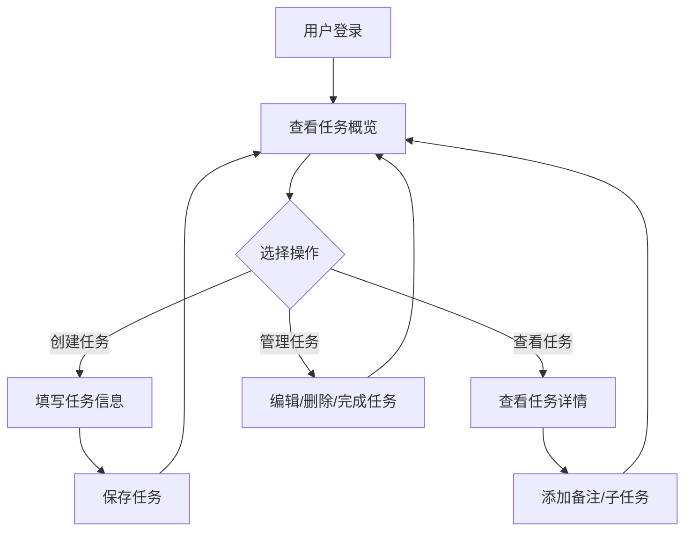

# 待办事项网站 - 产品需求文档 (PRD)

## 1. Product Overview
一个功能全面的待办事项管理网站，帮助用户高效管理日常任务，提高生产力和时间管理能力。
- **核心目标**: 提供直观、便捷的任务管理体验，支持任务创建、编辑、分类、优先级设置和进度追踪
- **目标用户**: 个人用户、团队成员、学生等需要高效管理任务的人群

## 2. Core Features

### 2.1 User Roles
| Role | Registration Method | Core Permissions |
|------|---------------------|------------------|
| 用户 | 邮箱注册/登录 | 创建、编辑、删除任务，管理个人任务列表 |

### 2.2 Feature Module
1. **任务管理**: 创建、编辑、删除任务，设置截止日期和优先级
2. **任务分类**: 按标签/项目分组管理任务
3. **进度追踪**: 查看任务完成状态和统计数据
4. **提醒功能**: 任务到期提醒和通知

### 2.3 Page Details
| Page Name | Module Name | Feature description |
|-----------|-------------|---------------------|
| Dashboard | 任务概览 | 展示任务统计、今日待办、最近完成 |
| 任务列表 | 任务管理 | 创建新任务、编辑任务、标记完成、删除任务 |
| 任务详情 | 任务详情 | 查看任务详情、添加备注、设置子任务 |
| 设置 | 个人设置 | 用户信息、主题设置、通知偏好 |

## 3. Core Process

## 4. User Interface Design

### 4.1 Design Style
- **主色调**: 深蓝色 (#1e40af) 搭配薄荷绿 (#10b981) 作为强调色
- **按钮风格**: 圆角矩形，悬停时有微妙的缩放效果
- **字体**: 标题使用 Inter SemiBold，正文使用 Inter Regular
- **布局风格**: 卡片式布局，清晰的信息层级
- **图标**: 使用 Lucide 图标库

### 4.2 Page Design Overview
| Page Name | Module Name | UI Elements |
|-----------|-------------|-------------|
| Dashboard | 统计卡片 | 圆形进度条、数字统计、趋势图表 |
| Dashboard | 任务列表预览 | 卡片式任务卡片、状态标签、优先级标识 |
| 任务列表 | 任务列表 | 列表视图、筛选器、搜索框、批量操作 |
| 任务详情 | 详情面板 | 标题、描述、截止日期、优先级、标签、子任务列表 |
| 设置 | 设置表单 | 用户头像、基本信息、主题切换、通知开关 |

### 4.3 Responsiveness
- **桌面端**: 三栏布局（侧边栏、主内容、详情面板）
- **平板端**: 两栏布局（侧边栏折叠为图标、主内容）
- **移动端**: 单栏布局，底部导航栏

### 4.4 Interactions
- 任务卡片拖拽排序
- 任务状态切换动画
- 悬停显示操作按钮
- 平滑页面过渡