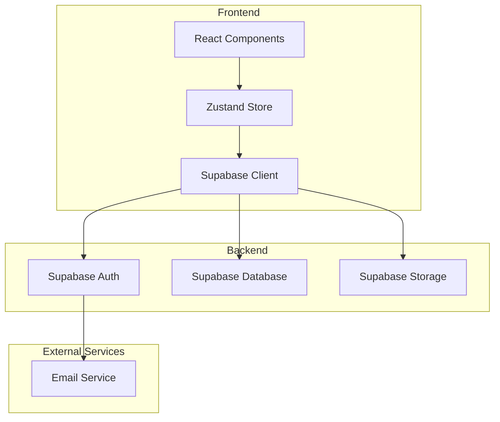
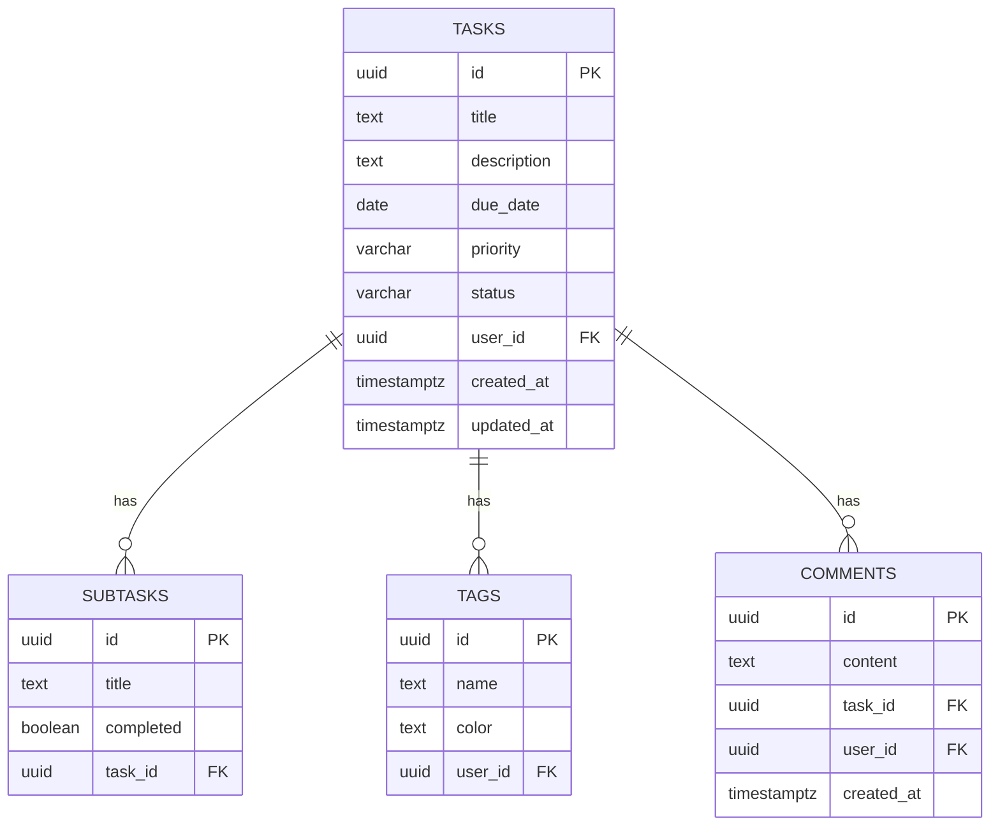

# 待办事项网站 - 技术架构文档

## 1. Architecture Design


## 2. Technology Description
- **Frontend**: React@18 + TypeScript + TailwindCSS@3 + Vite
- **State Management**: Zustand
- **Routing**: React Router DOM
- **Icons**: Lucide React
- **Backend**: Supabase (Authentication, Database, Storage)

## 3. Route Definitions
| Route | Purpose | Component |
|-------|---------|-----------|
| / | Dashboard 首页 | Dashboard |
| /tasks | 任务列表页面 | TaskList |
| /tasks/:id | 任务详情页面 | TaskDetail |
| /settings | 设置页面 | Settings |

## 4. Data Model

### 4.1 Data Model Definition


### 4.2 Data Definition Language
```sql
-- Tasks table
CREATE TABLE tasks (
    id UUID PRIMARY KEY DEFAULT gen_random_uuid(),
    title TEXT NOT NULL,
    description TEXT,
    due_date DATE,
    priority VARCHAR(20) DEFAULT 'medium',
    status VARCHAR(20) DEFAULT 'pending',
    user_id UUID NOT NULL REFERENCES auth.users(id),
    created_at TIMESTAMPTZ DEFAULT NOW(),
    updated_at TIMESTAMPTZ DEFAULT NOW()
);

-- Subtasks table
CREATE TABLE subtasks (
    id UUID PRIMARY KEY DEFAULT gen_random_uuid(),
    title TEXT NOT NULL,
    completed BOOLEAN DEFAULT false,
    task_id UUID NOT NULL REFERENCES tasks(id) ON DELETE CASCADE
);

-- Tags table
CREATE TABLE tags (
    id UUID PRIMARY KEY DEFAULT gen_random_uuid(),
    name TEXT NOT NULL,
    color TEXT DEFAULT '#1e40af',
    user_id UUID NOT NULL REFERENCES auth.users(id)
);

-- Task tags junction table
CREATE TABLE task_tags (
    task_id UUID REFERENCES tasks(id) ON DELETE CASCADE,
    tag_id UUID REFERENCES tags(id) ON DELETE CASCADE,
    PRIMARY KEY (task_id, tag_id)
);

-- Comments table
CREATE TABLE comments (
    id UUID PRIMARY KEY DEFAULT gen_random_uuid(),
    content TEXT NOT NULL,
    task_id UUID NOT NULL REFERENCES tasks(id) ON DELETE CASCADE,
    user_id UUID NOT NULL REFERENCES auth.users(id),
    created_at TIMESTAMPTZ DEFAULT NOW()
);

-- Indexes
CREATE INDEX idx_tasks_user_id ON tasks(user_id);
CREATE INDEX idx_tasks_status ON tasks(status);
CREATE INDEX idx_tasks_due_date ON tasks(due_date);
```

## 5. Component Structure
```
src/
├── components/
│   ├── layout/
│   │   ├── Sidebar.tsx
│   │   ├── Header.tsx
│   │   └── Layout.tsx
│   ├── dashboard/
│   │   ├── StatsCard.tsx
│   │   ├── TaskPreview.tsx
│   │   └── ProgressChart.tsx
│   ├── tasks/
│   │   ├── TaskCard.tsx
│   │   ├── TaskForm.tsx
│   │   ├── TaskList.tsx
│   │   └── TaskDetail.tsx
│   ├── ui/
│   │   ├── Button.tsx
│   │   ├── Input.tsx
│   │   ├── Select.tsx
│   │   └── Modal.tsx
├── pages/
│   ├── Dashboard.tsx
│   ├── TaskListPage.tsx
│   ├── TaskDetailPage.tsx
│   └── Settings.tsx
├── store/
│   └── tasks.ts
├── hooks/
│   └── useTasks.ts
├── utils/
│   └── supabase.ts
└── types/
    └── index.ts
```

## 6. State Management
使用 Zustand 管理全局状态：
- tasks: 任务列表
- selectedTask: 当前选中的任务
- filters: 筛选条件（优先级、状态、标签）
- isDarkMode: 主题模式

## 7. API Integration
使用 Supabase Client SDK 进行数据操作：
- `supabase.auth`: 用户认证
- `supabase.from('tasks')`: 任务 CRUD 操作
- `supabase.from('subtasks')`: 子任务操作
- `supabase.from('tags')`: 标签操作

## 8. Security
- 使用 Supabase Row Level Security (RLS)
- 用户只能访问自己的数据
- 敏感操作需要用户认证